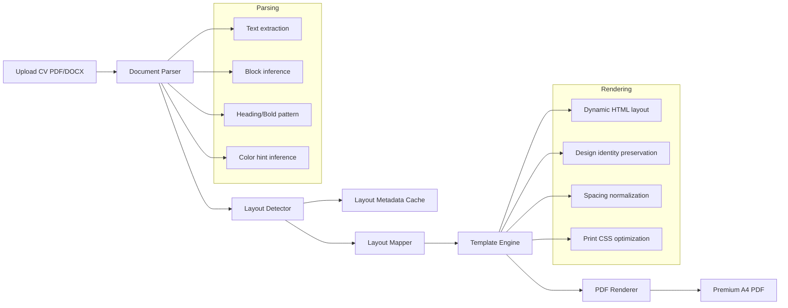

# Intelligent CV Layout Reconstruction Engine

## 1) Architecture conceptuelle



## 2) Layout detection (rule-based, <300ms)

Pseudo-code:

```text
input: originalText, requestedTemplate
features = extractFeatures(originalText)

features:
  - section markers frequency
  - short-line ratio (sidebar signal)
  - date pattern frequency
  - separator markers
  - contact header markers
  - spacing ratio (empty lines / total lines)

layoutInference:
  if sidebarMarkers>=2 and sectionMarkers>=3 and shortLineRatio>0.22:
      layoutType = two-column-left|two-column-right
  else:
      layoutType = single-column

metadata = {
  layoutType,
  columnCount,
  sidebarPosition,
  sidebarWidthRatio,
  primaryColor,
  accentColor,
  spacingProfile,
  hierarchyStyle,
  densityProfile,
  visualElementsDetected
}

cache by hash(originalText + requestedTemplate)
return metadata
```

## 3) Mapping layout -> template variant

```text
two-column-left      -> template_two_column_left_v2
two-column-right     -> template_two_column_right_v2
single + minimal     -> template_minimal_compact
single + executive   -> template_executive_balanced
asymmetric patterns  -> template_asymmetric_signature
```

## 4) Intelligent template engine

Rules implemented:

- Preserve column logic when detected.
- Preserve sidebar structure when present.
- Preserve color identity via style-config variables.
- Normalize spacing scale globally.
- Standardize heading hierarchy and date alignment.
- Keep min font size >= 10.5px.
- Keep A4 single-page tendency with constrained gaps and compact line-height.

## 5) Print CSS standards

- Fixed A4 page via `@page size: A4`.
- Controlled page margins in mm.
- `break-inside: avoid` / `page-break-inside: avoid` on critical blocks.
- Widow/orphan control for list and paragraph text.
- Print color adjustment enabled.

## 6) Scalabilité

- `layout-detector` independent and cacheable.
- `layout-mapper` deterministic and stateless.
- `style-config` centralized design tokens.
- `template-engine` pure rendering layer.
- `pdf-renderer` isolated Puppeteer execution layer.
- Precompiled variant classes for stable output and low runtime overhead.

## 7) ML evolution strategy

Phase 1 (current): rule-based detector + deterministic mapping.

Phase 2:
- Collect anonymized layout metadata + user feedback labels.
- Train lightweight classifier to predict best template variant.
- Keep rule-based fallback as safety net.

Phase 3:
- Add visual block extraction model from PDF coordinates.
- Improve color/theme extraction confidence with block-level style signals.

## 8) Current module map

- `src/lib/layout-detector` : detection + metadata inference + cache
- `src/lib/layout-mapper` : variant mapping
- `src/lib/style-config` : spacing/typography/color scale
- `src/lib/template-engine` : dynamic HTML reconstruction
- `src/lib/pdf-renderer` : HTML -> PDF (Puppeteer)
- `src/app/api/cv/[id]/pdf/route.ts` : orchestration and fallback
